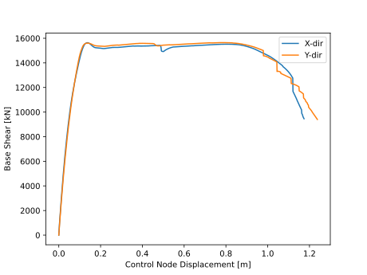

Design
------

The examples on this page demonstrate how to drive the full BED workflow
(BDIM → BNSM) using a geometry object — either loaded from an Excel file
(:class:`~simdesign.rcmrf.geometry.base.CustomGeometry`) or built
programmatically (:class:`~simdesign.rcmrf.geometry.base.StandardGeometry`).
A final section shows how to visualise the resulting design in 3-D using the
``design_plotter`` utility.

Design with a custom geometry
^^^^^^^^^^^^^^^^^^^^^^^^^^^^^^

A geometry exported with
:meth:`~simdesign.rcmrf.geometry.base.StandardGeometry.write_mesh_to_xlsx`
can be reloaded as a
:class:`~simdesign.rcmrf.geometry.base.CustomGeometry` object and used
directly in design.

.. code-block:: python

    import matplotlib.pyplot as plt
    from pathlib import Path
    from simdesign import rcmrf

    input_path = Path("example-custom-geometry.xlsx")
    custom_frame = rcmrf.CustomGeometry(input_path)
    custom_frame.add_new_elements_for_stairs()

    taxonomy_data = {
        "beta": 0.1,
        "beam_type": 2,
        "column_section": 1,
        "concrete_grade": "B225",
        "design_class": "eu_cdl",
        "quality": 1,
        "slab_type": 1,
        "steel_grade": "A40",
        "geometry": custom_frame,
    }
    taxonomy = rcmrf.TaxonomyData(**taxonomy_data)

    bdim = rcmrf.BDIM(taxonomy)
    bdim.run_iterative_design_algorithm()

    if bdim.ok:
        bdim.to_csv(Path("Outputs/BDIM-Data"))

        bnsm = rcmrf.BNSM(
            design=bdim,
            model="DP02",
            scheme="EQL",
            dincr=5e-4,
            max_drift=0.1,
            include_infills=False,
        )
        bnsm.to_py(Path("Outputs/OpsPy-Model"))
        bnsm.to_tcl(Path("Outputs/OpsTcl-Model"))

        bnsm.do_modal(num_modes=2, out_dir=Path("Outputs/Modal-Results"))
        bnsm.plot_model(directory=Path("Outputs"), show=True)
        bnsm.plot_mode_shape(mode_number=1, contour="x", show=True, directory=Path("Outputs"))
        bnsm.plot_mode_shape(mode_number=2, contour="y", show=True, directory=Path("Outputs"))

        dx, vx, _ = bnsm.do_nspa(ctrl_dof=1, out_dir=Path("Outputs/NSPA-X"))
        dy, vy, _ = bnsm.do_nspa(ctrl_dof=2, out_dir=Path("Outputs/NSPA-Y"))

        plt.plot(dx, vx, label="X-dir")
        plt.plot(dy, vy, label="Y-dir")
        plt.xlabel("Control Node Displacement [m]")
        plt.ylabel("Base Shear [kN]")
        plt.legend()
        plt.savefig(Path("Outputs/nspa.svg"), dpi=300)
        plt.close()

Design with a specific geometry
^^^^^^^^^^^^^^^^^^^^^^^^^^^^^^^

This example shows an 8-storey, 7×5-bay RC-MRF with a non-uniform layout:
two staircase bays, several modified bay widths, a modified ground-floor
height, and column rotation angles and section shapes assigned per grid
position.

**Building geometry**

.. code-block:: python

    from pathlib import Path
    import matplotlib.pyplot as plt
    from simdesign.rcmrf import StandardGeometry
    from simdesign import rcmrf

    outdir = Path("Outputs/specific-frame")

    regular_frame = StandardGeometry(
        num_storeys=8,
        storey_height=3.0,
        num_bays_x=7,
        bay_width_x=5.0,
        num_bays_y=5,
        bay_width_y=5.0,
    )

    # Two staircase bays
    regular_frame.set_continuous_stairs_rectangles(
        stair_loc=(1, 2), stairs_width_x=2.5, stairs_width_y=3.3
    )
    regular_frame.set_continuous_stairs_rectangles(
        stair_loc=(5, 2), stairs_width_x=2.5, stairs_width_y=3.3
    )

    # Non-uniform floor heights and bay widths
    regular_frame.modify_floor_height(floor_id=1, height=3.4)
    regular_frame.modify_bay_width(bay_id=2, width=3.3, direction="x")
    regular_frame.modify_bay_width(bay_id=4, width=3.3, direction="x")
    regular_frame.modify_bay_width(bay_id=6, width=3.3, direction="x")
    regular_frame.modify_bay_width(bay_id=3, width=3.3, direction="y")

    # Exterior infills only
    regular_frame.add_infills(
        exterior=True, interior=False, ext_type="Medium", int_type="Weak"
    )

    regular_frame.write_mesh_to_xlsx(outdir / "geometry.xlsx")
    regular_frame.add_new_elements_for_stairs(infills=True)
    regular_frame.export_mesh_to_html(str(outdir / "geometry.html"))

.. raw:: html

   <iframe
     src="../../_static/geometry/specific-frame-geometry.html"
     width="100%"
     height="500px"
     style="border:none; border-radius:4px;">
   </iframe>

**Column rotation angles**

The ``rot_angle`` attribute controls the orientation of a column's cross-section
in the horizontal plane. Two values are supported:

- ``0.0`` — the strong axis is aligned with the global X direction.
- ``90.0`` — the strong axis is aligned with the global Y direction.

Grids not listed in either group keep the default angle assigned during
geometry construction. Each grid is identified by its ``(ix, iy)`` position in
the plan.

.. code-block:: python

    # Grids whose columns have their strong axis along X (rot_angle = 0°)
    grids_x = [
        (1, 0), (2, 0), (3, 0), (4, 0), (5, 0), (6, 0),  # front facade
        (1, 5), (2, 5), (3, 5), (4, 5), (5, 5), (6, 5),  # back facade
    ]
    # Grids whose columns have their strong axis along Y (rot_angle = 90°)
    grids_y = [
        (0, 1), (0, 2), (0, 3), (0, 4),  # left facade
        (1, 1), (1, 2), (1, 3), (1, 4),
        (2, 1), (2, 2), (2, 3), (2, 4),
        (5, 1), (5, 2), (5, 3), (5, 4),
        (6, 1), (6, 2), (6, 3), (6, 4),
        (7, 1), (7, 2), (7, 3), (7, 4),  # right facade
    ]

    # Apply rotation angles to all vertical elements at the listed grids
    for grid, lines in regular_frame.continuous_lines_along_z.items():
        for line in lines:
            if grid in grids_x:
                line.rot_angle = 0.0
            elif grid in grids_y:
                line.rot_angle = 90.0

**Simulated design (BDIM) with mixed column sections**

.. code-block:: python

    taxonomy_data = {
        "beta": 0.09,
        "beam_type": 2,
        "column_section": 1,
        "slab_type": 1,
        "concrete_grade": "C30/37",
        "design_class": "eu_cdh",
        "quality": 0,
        "slab_orientation": 3,
        "steel_grade": "S500",
        "geometry": regular_frame,
    }
    taxonomy = rcmrf.TaxonomyData(**taxonomy_data)
    bdim = rcmrf.BDIM(taxonomy)

    # Corner and staircase grids keep square sections (section=1);
    # all other frame columns get rectangular sections (section=2)
    grids_s = [
        (0, 0), (7, 0), (0, 5), (7, 5),
        (3, 1), (4, 1), (3, 2), (4, 2),
        (3, 3), (4, 3), (3, 4), (4, 4),
    ]
    for grid, columns_list in bdim.continuous_columns.items():
        for columns in columns_list:
            for column in columns:
                column.section = 2 if grid in grids_x + grids_y else 1

    bdim.run_iterative_design_algorithm()
    bdim.to_csv(outdir / "design")

**Nonlinear model and analysis (BNSM)**

.. code-block:: python

    bnsm = rcmrf.BNSM(
        design=bdim,
        scheme="EQL",
        dincr=1e-3,
        max_drift=0.1,
        model="DP04",
        include_infills=True,
    )
    bnsm.to_py(outdir / "OpsPy-Model")
    bnsm.to_tcl(outdir / "OpsTcl-Model")

    bnsm.do_modal(num_modes=3, out_dir=outdir / "Modal-Results")
    bnsm.plot_model(directory=outdir, show=False)

.. raw:: html

   <iframe
     src="../../_static/modal/model_view.html"
     width="100%"
     height="500px"
     style="border:none; border-radius:4px;">
   </iframe>

.. code-block:: python

    bnsm.plot_mode_shape(mode_number=1, contour="y", show=False, directory=outdir)

.. raw:: html

   <iframe
     src="../../_static/modal/mode_1_shape.html"
     width="100%"
     height="500px"
     style="border:none; border-radius:4px;">
   </iframe>

.. code-block:: python

    bnsm.plot_mode_shape(mode_number=2, contour="x", show=False, directory=outdir)

.. raw:: html

   <iframe
     src="../../_static/modal/mode_2_shape.html"
     width="100%"
     height="500px"
     style="border:none; border-radius:4px;">
   </iframe>

.. code-block:: python

    dx, vx, _ = bnsm.do_nspa(ctrl_dof=1, out_dir=outdir / "NSPA-Results")
    dy, vy, _ = bnsm.do_nspa(ctrl_dof=2, out_dir=outdir / "NSPA-Results")

    plt.plot(dx, vx, label="X-dir")
    plt.plot(dy, vy, label="Y-dir")
    plt.xlabel("Control Node Displacement [m]")
    plt.ylabel("Base Shear [kN]")
    plt.legend()
    plt.savefig(outdir / "nspa.svg", dpi=300)
    plt.close()

.. note::

   The full source script for this example is available at
   ``scripts/design_with_specific_geometry.py`` in the repository.

Visualising the design
^^^^^^^^^^^^^^^^^^^^^^^

The ``scripts/design_plotter.py`` utility reads the CSV outputs written by
:meth:`~simdesign.rcmrf.bdim.baselib.building.BDIM.to_csv` and renders a 3-D
model of beams, columns, slabs, staircases, and (optionally) infill panels
using `PyVista <https://docs.pyvista.org>`_.

To use it, point ``design_dir`` to the folder produced by ``bdim.to_csv()``
and set ``infills_flag = True`` if infills were included in the design:

.. code-block:: python

    import pyvista as pv
    import pandas as pd
    from pathlib import Path
    from scripts.design_plotter import (
        create_beam, create_column, create_slab, create_staircase
    )

    infills_flag = False
    design_dir   = Path("Outputs/specific-frame/design")

    beams    = pd.read_csv(design_dir / "beams.csv")
    columns  = pd.read_csv(design_dir / "columns.csv")
    slabs    = pd.read_csv(design_dir / "slabs.csv")
    stairs   = pd.read_csv(design_dir / "stairs.csv")
    infills  = pd.read_csv(design_dir / "infills.csv")
    joints   = pd.read_csv(design_dir / "joints.csv")
    df_nodes = joints.set_index("id")

    plotter = pv.Plotter()

    beam_meshes = pv.MultiBlock()
    for _, row in beams.iterrows():
        nI, nJ   = row["node_i"], row["node_j"]
        coordsI  = df_nodes.loc[nI, ["x-coord [m]", "y-coord [m]", "z-coord [m]"]].to_numpy()
        coordsJ  = df_nodes.loc[nJ, ["x-coord [m]", "y-coord [m]", "z-coord [m]"]].to_numpy()
        beam_meshes.append(create_beam(coordsI, coordsJ, row["b [mm]"] / 1000, row["h [mm]"] / 1000))
    plotter.add_mesh(beam_meshes.combine(), color="red")

    column_meshes = pv.MultiBlock()
    for _, row in columns.iterrows():
        nI, nJ   = row["node_i"], row["node_j"]
        coordsI  = df_nodes.loc[nI, ["x-coord [m]", "y-coord [m]", "z-coord [m]"]].to_numpy()
        coordsJ  = df_nodes.loc[nJ, ["x-coord [m]", "y-coord [m]", "z-coord [m]"]].to_numpy()
        column_meshes.append(create_column(coordsI, coordsJ, row["bx [mm]"] / 1000, row["by [mm]"] / 1000))
    plotter.add_mesh(column_meshes.combine(), color="blue")

    slab_meshes = pv.MultiBlock()
    for _, row in slabs.iterrows():
        coords = [
            df_nodes.loc[row[n], ["x-coord [m]", "y-coord [m]", "z-coord [m]"]].to_numpy()
            for n in ["node_1", "node_2", "node_3", "node_4"]
        ]
        slab_meshes.append(create_slab(*coords, row["t [mm]"] / 1000))
    plotter.add_mesh(slab_meshes.combine(), color="lightgray", opacity=0.6)

    if stairs.any().any():
        stair_meshes = create_staircase(stairs, df_nodes)
        plotter.add_mesh(stair_meshes.combine(), color="green")

    # Export an interactive HTML file and open the interactive window
    plotter.export_html("specific-design.html")
    plotter.show()

The interactive visualisation below was produced by the example above for the
8-storey specific-geometry building (beams in red, columns in blue, slabs in
grey, staircases in green):

.. raw:: html

   <iframe
     src="../../_static/design/specific-design.html"
     width="100%"
     height="550px"
     style="border:none; border-radius:4px;">
   </iframe>
